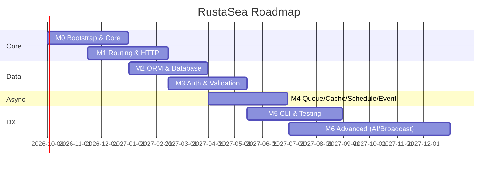

<p align="center"></p>

<p align="center">
<a href="https://github.com/rustasea/framework/actions/workflows/ci.yml"></a>
<a href="https://github.com/rustasea/framework/blob/master/rust-toolchain.toml"></a>
<a href="https://github.com/rustasea/framework/blob/master/LICENSE-MIT"></a>
<a href="docs/milestones.md"></a>
</p>

## About RustaSea

RustaSea is a web application framework for Rust with expressive, elegant syntax — the developer experience that made Laravel the most loved PHP framework, without sacrificing what makes Rust great. We believe development must be an enjoyable and creative experience to be truly fulfilling. RustaSea takes the pain out of development by easing common tasks used in many web projects, such as:

- [Simple, fast routing engine](crates/rustasea-router) with typed extractors and proc-macro attributes.
- [Powerful dependency injection container](crates/rustasea-foundation) with DAG-ordered service providers.
- Multiple back-ends for [session](crates/rustasea-auth) and [cache](crates/rustasea-cache) storage.
- Expressive, intuitive [database ORM](crates/rustasea-orm) backed by `sqlx`.
- Database agnostic [schema migrations](crates/rustasea-orm/src/migration.rs).
- [Robust background job processing](crates/rustasea-queue) on the `tokio` runtime.
- [Real-time event broadcasting](crates/rustasea-broadcast) over WebSocket, SSE, Pusher, and Redis.

RustaSea is accessible, powerful, and provides tools required for large, robust applications.

**Core thesis:** Laravel proves ergonomics and velocity win hearts; Rust proves safety and performance win production. RustaSea proves you can have both.

**Design principles:**

- **Convention over configuration** — sensible defaults, explicit opt-out.
- **Type safety as a feature** — generics, lifetimes, and traits replace runtime `any` blobs.
- **Zero-cost ergonomics** — expressive APIs that compile away where possible.
- **Incremental adoption** — use one crate or the full stack.

---

## Repository layout

RustaSea is split across repositories, mirroring the `laravel/framework`,
`laravel/laravel`, and `laravel/<x>-starter-kit` split:

- `rustasea/framework` (this repository) is the framework monorepo: 42 crates
  plus the `xtask` CI harness. This is where the framework itself is developed.
- `rustasea/rustasea` is the application skeleton repository (analog
  `laravel/laravel`) and holds the Blade variant. It is generated by
  `cargo rustasea new` and holds the application you build on top of the
  framework.
- `rustasea/react-starter-kit`, `rustasea/vue-starter-kit`,
  `rustasea/svelte-starter-kit`, and `rustasea/livewire-starter-kit` are the
  per-variant starter-kit repositories (analog `laravel/react-starter-kit`,
  `laravel/vue-starter-kit`, `laravel/svelte-starter-kit`, and
  `laravel/livewire-starter-kit`). Each holds a complete, runnable application
  for one presentation variant: Dioxus WASM + Inertia (react), Leptos WASM +
  Inertia (vue), Sycamore WASM + Inertia (svelte), and askama + HTMX (livewire).

---

## Learning RustaSea

RustaSea is documented in this repository and the companion repositories:

- [`docs/milestones.md`](docs/milestones.md) — authoritative, evidence-backed M0–M6 status.
- [`docs/laravel-parity.md`](docs/laravel-parity.md) — the Laravel 13.x API adoption mapping.
- [`docs/laravel-13-research.md`](docs/laravel-13-research.md) — the Laravel 13.0.0 research brief.
- [`docs/adr/`](docs/adr) — architecture decision records.
- [`.agents/documents/`](.agents/documents) — requirements, design, testing, and module blueprints.
- [`rustasea/rustasea`](https://github.com/rustasea/rustasea) is the Blade application skeleton template and the fastest way to start a project.
- Starter-kit repositories: [`rustasea/react-starter-kit`](https://github.com/rustasea/react-starter-kit), [`rustasea/vue-starter-kit`](https://github.com/rustasea/vue-starter-kit), [`rustasea/svelte-starter-kit`](https://github.com/rustasea/svelte-starter-kit), and [`rustasea/livewire-starter-kit`](https://github.com/rustasea/livewire-starter-kit) hold one runnable application per presentation variant.

New to the framework? Scaffold an application and read the generated `README.md`:

```bash
cargo install rustasea
cargo rustasea new example-app --variant blade   # or react | vue | svelte | livewire
cd example-app && cargo run
```

---

## Agentic Development

RustaSea's predictable structure and conventions make it ideal for AI coding
agents like Claude Code, Cursor, and GitHub Copilot. Every project exposes its
knowledge surface over the Model Context Protocol:

```bash
cargo artisan mcp:serve   # requires the `ai-mcp` feature on the `rustasea` crate
```

The MCP server gives agents 15+ tools and resources — route tables, model
introspection (`show:model`), documentation, configuration, and `make:plan`
scaffold planning — so agents build RustaSea applications while following best
practices. See [ADOPT-015](docs/milestones.md) for the parity notes.

## Why Rust × Laravel Ergonomics

| What Laravel does best | What Rust does best | RustaSea synthesis |
|---|---|---|
| Expressive routing, middleware, validation | Ownership, lifetimes, fearless concurrency | `axum` routing with typed extractors + proc-macro attributes (`#[middleware]`, `#[validate]`) |
| Eloquent ORM — fluent, chainable | Compile-time type safety | `sqlx`-backed query builder with derive macros; `whereVectorSimilarTo` from day one |
| Artisan code generation | `cargo` + proc-macros + `clap` | `cargo artisan make:*` with `clap`-powered CLI and `xtask` |
| Queue / Schedule / Events | `tokio` async runtime | Typed jobs/events (no `any`), backpressure-aware queues |
| Blade / JSON:API resources | `serde` / `askama` / `minijinja` | `JsonApiResource` via `serde` with sparse fieldsets + relationship inclusion; `rustasea-view` (askama default, minijinja opt-in) |
| Batteries-included DX | Minimal runtime, no GC | Pay only for crates you include; workspace-gated features |

**Who is RustaSea for?** Teams that outgrew dynamic-language frameworks on performance, correctness, or concurrency — but do not want to outgrow the productivity that made them ship fast.

---

## Laravel 13 Feature Map

Laravel 13.0.0 shipped 2026-03-17 (PHP 8.3+, 20 headline features). Every feature is mapped to the RustaSea milestone that delivers its equivalent.

| # | Laravel 13 Feature | Type | RustaSea Milestone | Notes |
|---|---|---|---|---|
| 1 | AI SDK (`laravel/ai`) — 12 providers, agents, tools, streams | NEW | **M6** | Provider-agnostic trait + agentic workflow |
| 2 | AI Agents (tools, structured output, streaming, MCP, queueing) | NEW | **M6** | `make:agent` / `make:tool`, sub-agents, middleware |
| 3 | JSON:API Resources (`JsonApiResource`) | NEW | **M6** | `serde`-based with sparse fieldsets, links, headers |
| 4 | Queue Routing by Class (`Queue::route()`) | NEW | **M4** | Central registry `Queue::route::<Job>(queue:)` |
| 5 | Cache `touch()` — extend TTL without get/set | NEW | **M4** | Added to `Store` + `Repository` traits |
| 6 | Semantic / Vector Search (`whereVectorSimilarTo`, `toEmbeddings`) | NEW | **M2** + **M6** | `pgvector` + embedding trait from day one |
| 7 | Expanded PHP Attributes (declarative) | NEW | **M5** | Rust proc-macros: `#[middleware]`, `#[tries]`, `#[authorize]`, etc. |
| 8 | Laravel Cloud Facade & Cloud Queue metrics | NEW | **M4** | Cloud driver + queue depth/age metrics |
| 9 | Read-through Filesystem (primary + fallback disk) | NEW | **M6** | `Storage` with fallback + path confinement |
| 10 | Schedule Pause / Resume (`schedule:pause`) | NEW | **M4** | `schedule:pause` / `schedule:resume` + events |
| 11 | Request Forgery Protection (origin-aware `Sec-Fetch-Site`) | IMPROVED | **M3** | `PreventRequestForgery` with origin verification |
| 12 | Cache & Session Hardening (JSON serialization, allow-list) | IMPROVED | **M3** / **M4** | `serde` allow-listing; JSON session store by default |
| 13 | Eloquent Collection Serialization (relations survive serialize) | IMPROVED | **M2** | `serde` round-trip preserves eager-loaded relations |
| 14 | Database Upsert & Delete Improvements (strict `uniqueBy`) | IMPROVED | **M2** | `upsert` validates `uniqueBy`; MySQL `DELETE JOIN` support |
| 15 | Eloquent / Query Builder Additions (`insertOrIgnoreReturning`, etc.) | IMPROVED | **M2** | `chunkBy`, `whereBinary`, `orWhereKey`, `StraightJoin` |
| 16 | Event / Queue Contract Expansion (`dispatchAfterResponse`, etc.) | IMPROVED | **M4** | Expanded `Dispatcher` + `Queue` traits |
| 17 | Mail / Notification Defaults | IMPROVED | **M6** | Queued notification `DeleteWhenMissingModels` |
| 18 | HTTP Client & Process (`throw` callbacks, `CarbonInterval` timeouts) | IMPROVED | **M1** | Typed HTTP client with `reqwest` |
| 19 | Routing & Validation (domain priority, strict `in_array`, `ErrorBag`) | IMPROVED | **M1** / **M3** | Domain-route precedence; strict validation |
| 20 | Observability & Tooling (`show:model`, `route:list` binding fields) | IMPROVED | **M1** / **M5** | Model inspector, route introspection |

> Source: [`docs/laravel-13-research.md`](docs/laravel-13-research.md) — cross-checked against `laravel.com/docs/releases`, `laravel.com/docs/13.x/upgrade`, and `laravel/framework` v13.0.0 changelog.

---

## Goravel Inspiration

[Goravel](https://goravel.dev) (Go port of Laravel, v1.18) is the closest prior art and the primary reference for porting Laravel idioms to a compiled, statically-typed language.

**What Goravel proves works:**

- **Service providers** with explicit `Register` → `Boot` lifecycle and DAG ordering (`Relationship()`) + `Runner` lifecycle (HTTP, Queue, Schedule) translate cleanly to Rust — RustaSea implements this: `ServiceProvider::dependencies()` + a real topological sort with typed cycle detection (`crates/rustasea-foundation/src/lib.rs:27`, `:296`, `BootError::DependencyCycle` at `:187`).
- **Container** (`Bind` / `Singleton` / `Instance` + `Make`) — in Rust this becomes trait objects + `Any` / `typemap` with compile-time registration.
- **ORM** — `facades.Orm().Query()` builder over GORM shows a fluent Eloquent-style API is viable outside PHP; Rust equivalent uses `sqlx` with derive macros.
- **Artisan CLI** (`make:controller`, `make:job`, signatures + typed Args/Flags) maps to `clap` + `cargo xtask` with `#[command]` proc-macros.
- **Queue / Event / Schedule / Cache / Auth** — typed `queue.Arg` / `event.Arg` patterns, `Cache::Remember`, `Auth(ctx).Login` all have direct Rust analogues.

**What RustaSea does differently:**

| Goravel (Go) | RustaSea (Rust) |
|---|---|
| Global facades `facades.Cache().Get()` | Explicit `AppState` via `axum::extract::State` (`OnceLock` / `Arc`, no global `static mut`) |
| `any` / `interface{}` job/event args | Strongly-typed generic jobs/events — `Job<T>`, `Event<T>` |
| Runtime reflection for container | Proc-macros + trait bounds; no reflection |
| `gin` / `fiber` router | `axum` (tower-native, `tokio`-aligned) |
| `testify/suite` + Docker helpers | `cargo test` + `testcontainers` + `PostgresTestDb` fixture |
| Stringly-typed config `GetString("app.name")` | Typed config via `config` + `serde` with env overlay |

> See `TASK-002` findings for the full Goravel → Rust mapping table and crate implications.

---

## Milestones

Milestones are **dependency-ordered**: each builds only on predecessors. No circular dependencies.

> **Status:** See [`docs/milestones.md`](docs/milestones.md) for the authoritative, evidence-backed done/partial/missing recap of M0–M6, and [`docs/laravel-parity.md`](docs/laravel-parity.md) for the Laravel 13.x API adoption mapping.

### M0 — Bootstrap & Core

| Field | Detail |
|---|---|
| **Goal** | Bootable application skeleton with config, container, and service providers. |
| **Scope** | `foundation::Application`, typed config loader (TOML + env overlay), service container (`Bind`/`Singleton`/`Instance`), provider lifecycle (`register` → `boot`) with dependency DAG ordering, graceful shutdown, `.env` support. |
| **Deliverables** | `rustasea` umbrella crate, `rustasea-foundation` crate, `cargo rustasea new <app> --variant {blade\|react\|vue\|svelte\|livewire}` scaffold, `config/` directory, `bootstrap/app.rs` entry point, example `AppServiceProvider`. |
| **Success Criteria** | `cargo run` boots, loads config from `config/*.toml` + `.env`, resolves a bound singleton from the container, and shuts down gracefully on `SIGTERM`. |
| **Laravel 13 features** | Container `call` semantics, `Manager::extend` closure binding. |

> **Status (2026-09-12):** Partial. The config loader auto-discovers every `config/*.toml` (`crates/rustasea-config/src/lib.rs:89`, `load_from_dir` at `:40`; TOML only — no YAML), and provider boot runs a real topological sort with cycle detection (`crates/rustasea-foundation/src/lib.rs:275`, `:296`). `bootstrap/providers.rs:35` and `bootstrap/commands.rs:12` are populated; the scaffolded `AppServiceProvider` is still a no-op (`bootstrap/providers.rs:17`), and the config loader is not yet mounted during app boot. Tracked in `GAP-019` (completed) and `GAP-P5`.

### M1 — Routing & HTTP

| Field | Detail |
|---|---|
| **Goal** | Expressive HTTP layer with routing, middleware, and request/response ergonomics. |
| **Scope** | `axum`-backed router (`get`/`post`/`put`/`delete`/`patch`/`options`/`any`), route groups + prefix + naming, `resource` helper, domain-aware routing (domain routes prioritized), `route:list` introspection, middleware stack (including `throttle` / `cors`), typed request extractors, `Json`/`View` responses, HTTP client (`reqwest` wrapper with `throw` callbacks). |
| **Deliverables** | `rustasea-router` + `rustasea-http` crates, `routes/web.rs`, `#[route]` proc-macro, `cargo artisan route:list`. |
| **Success Criteria** | Define `Route::get("/users", [UserController, "index"])` equivalent in Rust, hit it with `cargo test` HTTP assertions, see it in `route:list` with middleware and binding fields. Domain catch-all routes do not shadow non-domain routes. |
| **Laravel 13 features** | #18 HTTP Client & Process, #19 domain-route priority, #20 `route:list` binding fields. |

> **Status (2026-09-17):** Partial. The router DSL and controller dispatch are real, and `route:list` renders the live 6-column route table (Method, URI, Name, Action, Middleware, Binding) published by the application at boot through the process-wide `RouteSource` closure (`crates/rustasea-cli/src/routes.rs:19`, `:33`; `crates/rustasea-app/src/bootstrap/app.rs:57`; read back at `crates/rustasea-cli/src/commands/inspect.rs:44`). The HTTP client idle (inter-chunk) timeout is enforced for streamed bodies (`crates/rustasea-http/src/idle.rs:23`, wired in `crates/rustasea-http/src/lib.rs:448`); URL generation and implicit route-model binding remain open.

### M2 — ORM & Database

| Field | Detail |
|---|---|
| **Goal** | Fluent, type-safe database layer with migrations, seeders, and factories. |
| **Scope** | Query builder over `sqlx` (drivers: Postgres, MySQL, SQLite), `where`/`orWhere`/`whereJson*`, `find`/`first`/`firstOrFail`, `create`/`save`/`update`/`delete`/`forceDelete`, `paginate`/`cursor`, scopes, transactions, `toSql`/`toRawSql`, pessimistic locks, raw queries, `insertOrIgnoreReturning`/`saveOrIgnore`/`refreshForUpdate`/`whereBinary`/`chunkBy`/`orWhereKey`, `#[derive(Model)]` with `id`/`created_at`/`updated_at`/`deleted_at` (soft deletes), snake_plural table convention, vector extension (`whereVectorSimilarTo`, `vector` column type). Migrations via the custom `Migrator` (`cargo artisan make:migration` + `migrate`/`migrate:fresh`/`migrate:rollback`), seeders, factories. |
| **Deliverables** | `rustasea-orm` crate, `database/migrations/`, `database/seeders/`, `#[derive(Model)]` macro, `cargo artisan make:model` generator, `pgvector` support behind feature flag. |
| **Success Criteria** | Create a `User` model, run `cargo artisan migrate`, `Factory::create(&user)` in tests, demonstrate `whereVectorSimilarTo` with `pgvector`, and round-trip a collection with eager-loaded relations via `serde`. |
| **Laravel 13 features** | #6 vector search, #13 collection serialization, #14 upsert/delete, #15 query builder additions. |

### M3 — Auth, Middleware & Validation

| Field | Detail |
|---|---|
| **Goal** | Complete auth, authorization, and validation with hardened security defaults. |
| **Scope** | Auth guards (JWT via `jsonwebtoken` + session), `login`/`loginUsingId`/`parse`/`refresh`/`logout`/`user`/`id`, `Auth::extend` for custom guards, `#[authorize]` attribute, CSRF origin-aware protection (`PreventRequestForgery` with `Sec-Fetch-Site` check), `#[middleware]` attribute, rate limiter (`limit.perMinute().by(ip)` → `Throttle`), CORS, validation rules (strict `in_array`/`contains`/`doesnt_contain`, `ErrorBag` for form requests), `#[validate]` proc-macro, session store (JSON serialization by default), security allow-list for deserialization. |
| **Deliverables** | `rustasea-auth` + `rustasea-validation` crates, `app/http/middleware/`, `cargo artisan make:middleware` / `make:request` (both implemented — `crates/rustasea-cli/src/generators/kinds/{middleware,request}.rs:17`), JWT + session guard implementations. |
| **Success Criteria** | Guard mismatch returns typed `Error::GuardMismatch`; CSRF rejects cross-site `POST` without valid `Sec-Fetch-Site`; `#[validate]` rejects strict-mismatch payloads; session cookie uses JSON serialization and hyphenated cache prefix. |
| **Laravel 13 features** | #11 origin-aware CSRF, #12 cache/session hardening, #19 strict validation + `ErrorBag`. |

> **Status (2026-09-17):** Partial. JWT, CSRF, throttle, validation, and the `tower-sessions`-backed `SessionGuard` are real (`crates/rustasea-auth/src/session.rs:99`, login/parse/refresh/logout at `:296`–`:408`), and the declarative attributes are now consumed at runtime: `#[middleware]` resolves through `MiddlewareRegistry` (`crates/rustasea-router/src/metadata.rs:237`, applied in `dispatch.rs:109`) and `#[authorize]` resolves through `AuthorizeRegistry` (`crates/rustasea-router/src/authorize.rs:216`, applied in `dispatch.rs:135`), while the job-policy attributes `#[tries]`/`#[backoff]`/`#[timeout]` bind through `JobPolicy` (`crates/rustasea-queue/src/policy.rs:21`, `crates/rustasea-queue/src/driver/worker.rs:66`). See [`docs/milestones.md`](docs/milestones.md) for the `GAP-003` reconciliation note.

### M4 — Queue, Cache, Scheduling & Events

| Field | Detail |
|---|---|
| **Goal** | Async workloads, caching, scheduling, and event dispatch with observable queue metrics. |
| **Scope** | Queue: `Queue::route::<Job>(connection:, queue:)` central routing, `Job` trait with `handle`, `ShouldRetry` / `#[tries]` / `#[backoff]` / `#[timeout]`, drivers `sync` + `database` + `redis` (via `deadpool-redis`), `dispatch`/`dispatchSync`/`chain`/`delay`/`onQueue`/`onConnection`, batch dispatch, `queue:failed` / `queue:retry`, `failed_jobs` table. Cache: `get`/`put`/`add`/`remember`/`forever`/`forget`/`flush`/`increment`/`decrement`/`pull`/`has` + `touch()` (extend TTL), `Lock` (atomic `get`/`block`/`release`), stores `memory` + `redis`, `withContext`/`store("redis")`. Events: `Event` trait, `Listener` with `Queue { enable: true }` for async, `dispatch` + `dispatchAfterResponse`, `JobAttempted { exception }`, `QueueBusy { connectionName }`. Schedule: `schedule:list`, `schedule:run`, `schedule:pause`/`schedule:resume` + `SchedulePaused`/`ScheduleResumed` events, frequencies (`daily`/`cron`/`everyMinute`/`skipIfStillRunning`/`onOneServer`). Cloud queue metrics (`pendingSize`/`delayedSize`/`reservedSize`/`creationTimeOfOldestPendingJob`). |
| **Deliverables** | `rustasea-queue` + `rustasea-cache` + `rustasea-events` + `rustasea-schedule` crates, `app/jobs/`, `app/events/`, `app/listeners/`, `cargo artisan make:job` / `make:event` / `make:listener`. |
| **Success Criteria** | Dispatch a typed job to a routed queue and assert it executes; `Cache::touch` extends TTL without re-reading; `schedule:pause` halts the scheduler and emits `SchedulePaused`; event listener runs async when `Queue { enable: true }`. |
| **Laravel 13 features** | #4 queue routing, #5 `Cache::touch`, #8 Cloud queue metrics, #10 schedule pause/resume, #16 event/queue contracts. |

> **Status (2026-09-12):** Partial. Real `database` + `redis` queue drivers, the worker loop, DB-backed `failed_jobs`, `queue:work`/`queue:failed`/`queue:retry`, the feature-gated Redis **cache** store, async queue-backed event listeners, and `schedule:list`/`run`/`pause`/`resume` are all implemented (`crates/rustasea-queue/src/driver/{database,redis,worker}.rs`; `crates/rustasea-cli/src/commands/ops.rs:21`, `:72`; `crates/rustasea-cache/src/redis.rs:155`; `crates/rustasea-events/src/dispatcher.rs:82`). Remaining: the in-process `SyncDriver` still keeps failed jobs in memory (`crates/rustasea-queue/src/driver.rs:171`), and declarative job metadata (`#[tries]`/`#[backoff]`/`#[timeout]`) is not consumed at runtime. Tracked in `GAP-004`–`GAP-009` (completed).

### M5 — DX, CLI & Testing

| Field | Detail |
|---|---|
| **Goal** | First-class developer experience: CLI, code generation, and a testing story that feels like Laravel. |
| **Scope** | `cargo artisan` CLI (via `clap` + `cargo xtask`): `list`, `make:*` (controller, middleware, request, model, provider, command, job, event, listener, observer, test, seeder, migration, agent, tool, action, module — 17 kinds; see [Artisan CLI](#artisan-cli)), typed command args/flags, `ask`/`secret`/`confirm`/`choice`/`multiSelect` prompts, `table`/`progressBar`/`spinner`, graceful shutdown (`Shutdownable`), programmatic `Artisan::call()`. Declarative attributes: `#[middleware]`, `#[authorize]`, `#[tries]`, `#[backoff]`, `#[timeout]`, `#[usage]`/`#[help]`/`#[hidden]` for commands (`#[middleware]`/`#[authorize]` are consumed at runtime through the router registries and `#[tries]`/`#[backoff]`/`#[timeout]` bind through `JobPolicy`; see M3 status). Testing: `cargo test` integration, `TestCase` harness, `testcontainers`-backed isolated Postgres fixture (`PostgresTestDb`, `crates/rustasea-testing/src/fixtures.rs:49`), `Factory::create`, `Str` factory resets between tests, paginator views. |
| **Deliverables** | `rustasea-cli` + `rustasea-macros` + `rustasea-testing` crates, `bootstrap/commands.rs` (populated — `:12`), `crates/rustasea/tests/feature/` integration suite, `cargo artisan make:test` generator, `#[test]` helpers. |
| **Success Criteria** | `cargo artisan make:controller UserController` scaffolds a controller (route registration stays manual — see status note); all generated `make:*` commands produce `rustfmt`-clean code that compiles; `cargo test` spins up an isolated Postgres via `testcontainers` and tears it down. |
| **Laravel 13 features** | #7 expanded attributes (all `#[Tries]`/`#[Backoff]`/`#[Timeout]`/`#[WithoutBroadcasting]` etc.), #20 `ModelInspector`/`route:list`/`Str` factory resets. |

> **Status (2026-09-12):** Partial. The 17 `make:*` generators, `cargo rustasea new --variant {blade|react|vue|svelte|livewire}`, real `xtask check-cycles` DAG validation, `xtask migrate`, and the testcontainers `PostgresTestDb` fixture are implemented (`crates/rustasea-cli/src/commands/mod.rs:17-31`; `crates/rustasea/src/bin/cargo-rustasea.rs:46`; `xtask/src/cycles.rs:32`; `xtask/src/main.rs:37`; `crates/rustasea-testing/src/fixtures.rs:49`). Remaining: Docker-gated integration tests are opt-in (`cargo test -p rustasea --features integration -- --ignored`), and generated controllers leave route registration manual (`crates/rustasea-cli/src/generators/kinds/controller.rs:32`). Tracked in `GAP-016`–`GAP-018` (completed).

### M6 — Advanced (Broadcasting, Search, Filesystem, AI SDK, Real-time)

| Field | Detail |
|---|---|
| **Goal** | Differentiate RustaSea with AI-native capabilities and complete Laravel parity on advanced features. |
| **Scope** | Broadcasting & real-time: WebSocket via `axum` (`ws` feature), channel auth, `ShouldBroadcast` trait, SSE via `Response::eventStream`. Search: `whereVectorSimilarTo` integration with embedding providers, `Str::toEmbeddings`, `dropVectorIndex`. Filesystem: read-through disk (primary + fallback with optional copy), `Storage::path()` confinement, `Storage` facade over `object_store` / local, `config/storage.toml` disk configuration. JSON:API resources: `JsonApiResource` with sparse fieldsets, relationship inclusion, links, headers. Notifications & mail: `rustasea-mail` (`Mailable`, `Mailer`, `ArrayMailer`/`LogMailer`/`SmtpMailer`, queued with `#[deleteWhenMissingModels]`). Server-side presentation: `rustasea-view` (askama default, minijinja behind `runtime-templates`), `rustasea-inertia` + `rustasea-inertia-client` + `rustasea-inertia-adapters`, `rustasea-livewire`, `rustasea-scaffold` starter kits. AI SDK (`rustasea-ai`): provider-agnostic trait with real HTTP adapters (OpenAI, Anthropic, Azure, Groq, xAI, DeepSeek, Mistral, Ollama, OpenRouter, OpenAI-compatible), `Agent` contracts, `make:agent`/`make:tool`, `SimilaritySearch`/`FileStorage`/`ToolSearch` deferred loading, sub-agents, middleware, anonymous agents, streaming + broadcasting + queueing (`AgentRunJob`), MCP client/registry. |
| **Deliverables** | `rustasea-broadcast` + `rustasea-storage` + `rustasea-search` + `rustasea-ai` + `rustasea-view` + `rustasea-inertia` + `rustasea-livewire` + `rustasea-scaffold` + `rustasea-mail` crates, `app/ai/agents/` + `app/ai/tools/`, `resources/views/`, `cargo artisan make:agent` / `make:tool`. |
| **Success Criteria** | Define an `Agent` with a `Tool`, stream its response over WebSocket, and assert the stream includes structured output; `Storage` read falls through to fallback disk and `path()` never escapes root; `JsonApiResource` renders correct `Content-Type: application/vnd.api+json` with sparse fieldsets. |
| **Laravel 13 features** | #1 AI SDK, #2 AI Agents, #3 JSON:API Resources, #6 semantic/vector search (full), #9 read-through filesystem, #17 mail/notification defaults, #18 SSE `eventStream`. |

> **Status (2026-09-12):** Partial. Broadcast WS (default `ws` feature → `axum/ws`) + SSE, `object_store`-backed storage with the `config/storage.toml` facade, JSON:API, `rustasea-mail`, the view/Inertia/Livewire/scaffold presentation crates, real HTTP AI providers (`provider_from_env()`, `crates/rustasea-ai/src/providers/mod.rs:27`), AI queueing (`crates/rustasea-ai/src/queue.rs:41`), MCP client/registry (`crates/rustasea-ai/src/mcp/client.rs:40`), and feature-gated `pgvector` (`crates/rustasea-search/src/pgvector.rs:24`) are implemented. Remaining: Gemini/Bedrock have no adapter (`AiError::UnknownProvider`, `crates/rustasea-ai/src/providers/client.rs:223`), embeddings fall back to the deterministic stub (`crates/rustasea-search/src/embeddings.rs:97`), and `InProcessProvider` remains for deterministic tests (`crates/rustasea-ai/src/adapters.rs:50`). Tracked in `GAP-012`, `GAP-014`, `GAP-015`, `GAP-020` (completed).

---

## Artisan CLI

`cargo artisan <command>` runs the framework console. The `cargo-rustasea`
binary ships in the `rustasea` facade package (install with `cargo install
rustasea`) and exposes the `cargo rustasea` subcommand, with `cargo artisan`
retained as the in-app alias. The registry
(`crates/rustasea-cli/src/commands/mod.rs:22`) registers **37 default commands**
plus the feature-gated `mcp:serve`. Run `cargo artisan list` for the live
surface; `list --json` emits the same metadata as machine-readable JSON.

### Generators (`make:*`)

17 scaffolds. `{name}` is PascalCase (snake_case for `make:migration`).
`--force`/`-f` overwrites; `--resource`/`-r` (controller) adds resource methods;
`-m`/`--migration` (model) emits a migration; `--browser` (test) targets the
WebDriver e2e harness under `tests/browser/`
(`crates/rustasea-cli/src/generators/mod.rs:245`, `:297`).

| Command | Purpose |
|---|---|
| `make:controller {name} [--resource] [--force]` | HTTP controller |
| `make:middleware {name} [--force]` | axum HTTP middleware |
| `make:request {name} [--force]` | Validated form request |
| `make:model {name} [-m] [--force]` | ORM model (+ optional migration) |
| `make:provider {name} [--force]` | Service provider |
| `make:command {name} [--force]` | Console command |
| `make:job {name} [--force]` | Queue job |
| `make:event {name} [--force]` | Domain event |
| `make:listener {name} [--force]` | Event listener |
| `make:observer {name} [--force]` | Model lifecycle observer |
| `make:test {name} [--force] [--browser]` | Feature test, or browser e2e test with `--browser` |
| `make:seeder {name} [--force]` | Database seeder |
| `make:migration {name} [--force]` | Database migration (snake_case name) |
| `make:agent {name} [--force]` | AI agent scaffold (M6) |
| `make:tool {name} [--force]` | AI tool scaffold (M6) |
| `make:action {name} [--force]` | Action class (ADOPT-028) |
| `make:module {name} [--force]` | Modular application crate (ADOPT-027) |

### Modules

Module state is discovered from `modules/<name>/` and persisted in the
`[modules]` table of `rustasea.toml` (or `config/modules.toml`). Enabling or
disabling an unknown name is rejected before the manifest is written
(`crates/rustasea-cli/src/commands/modules.rs`).

| Command | Purpose |
|---|---|
| `module:list [--json]` | List discovered modules with status and version |
| `module:enable {name}` | Mark a module enabled |
| `module:disable {name}` | Mark a module disabled |

### Routing & introspection

| Command | Purpose |
|---|---|
| `list [--json] [--all]` | List available commands (`--all` includes hidden) |
| `route:list [--json]` | Render the live route table (Method, URI, Name, Action, Middleware, Binding) |
| `show:model {name} [--json]` | Inspect a model's source metadata (attributes, casts, soft-delete/timestamps, relations) |
| `openapi:generate [--output=openapi.json] [--pretty]` | Emit an OpenAPI 3.1 spec from the live route table |

### Database & migrations

Connection resolution prefers `DATABASE_URL`, then `DATABASE__URL`, then
`config/database.toml` (`crates/rustasea-cli/src/commands/ops/migration.rs:40`).
A destructive `migrate:fresh` is refused in production unless `--force` is set.

| Command | Purpose |
|---|---|
| `migrate [--fresh] [--seed] [--force]` | Run pending migrations (`--seed` runs seeders after) |
| `migrate:fresh [--seed] [--force]` | Drop all tables and re-run every migration |
| `migrate:rollback [--step N]` | Roll back the last N migration batches (default 1) |

### Queue & schedule

| Command | Purpose |
|---|---|
| `queue:failed` | List dead-lettered jobs |
| `queue:retry {id}` | Retry a failed job by id |
| `queue:work [--queue=default] [--max-jobs=1]` | Process jobs from the database queue |
| `schedule:list [--json]` | List scheduled commands |
| `schedule:run` | Run due scheduled commands once |
| `schedule:pause` | Pause scheduled command dispatch |
| `schedule:resume` | Resume scheduled command dispatch |

### Localization, logging & interactive

`lang:check` (ADOPT-005) reports missing, unused, and duplicate translation
entries; `missing` and `duplicate` findings fail the command, `unused` is
informational (`crates/rustasea-cli/src/commands/langcheck.rs`).

| Command | Flags | Purpose |
|---|---|---|
| `lang:check` | `--locale=xx` (reference locale, defaults to `app_locale`), `--path=resources/lang` (base directory), `--json` | Check translation dictionaries for missing, unused, and duplicate entries |
| `log:show` | `--level` (min severity: trace/debug/info/warn/error), `--channel` (channel name, defaults to the configured default), `--since` (RFC 3339 lower bound), `--grep` (case-insensitive substring), `--limit` (newest N, default 200), `--follow` (poll appended lines every 250 ms), `--json` (newline-delimited JSON) | Filter, print, and optionally tail the application log (`crates/rustasea-cli/src/commands/log_show.rs:74`) |
| `tinker` | (none) | Interactive REPL for a booted application: `config`/container/route/command inspection with a friendly `help`; piped stdin scripts the session (ADOPT-008, `crates/rustasea-cli/src/commands/tinker.rs:43`) |

### AI agent workflows (feature-gated)

`mcp:serve` exposes the project knowledge surface over the Model Context
Protocol on stdin/stdout, so an AI coding agent can discover routes, docs,
commands, and redacted config (laravel/boost parity, ADOPT-015). It is gated
behind the `mcp` cargo feature
(`crates/rustasea-cli/src/commands/mod.rs:60-61`); a build without that feature
does not register the command.

| Command | Purpose |
|---|---|
| `mcp:serve` | Serve project knowledge (routes, docs, commands, config) over MCP stdio; config values are redacted and reads are confined to `docs/**.md` and `config/*.toml` |

> The MCP server advertises the tools `route:list`, `model:show`, `make:plan`,
> and `migrate:status`, and the resources `rustasea://docs/{name}`,
> `rustasea://config/{name}`, `rustasea://routes`, and `rustasea://commands`
> (`crates/rustasea-cli/src/commands/mcp_serve.rs:10-12`).

---

## Tech Stack

| Layer | Crate | Rationale |
|---|---|---|
| Async runtime | `tokio` | De-facto async runtime; powers `axum`, `sqlx`, `deadpool`, and queue workers. Work-stealing scheduler, `tokio::select!` for graceful shutdown. |
| HTTP | `axum` + `tower` + `tower-http` | Ergonomic, extractor-based routing; `tower` middleware composes cleanly; `tower-http` ships CORS, rate-limit, tracing, compression. Preferred over `actix-web` for `tokio` alignment and simpler ownership. |
| ORM / DB | `sqlx` | Runtime-checked queries via the `sqlx` API (no compile-time `query!` macros — CI has no `DATABASE_URL`); `pgvector` integration behind the `vector` feature. Migrations run through the custom `Migrator` (`crates/rustasea-orm/src/migration.rs:131`). Named connections (with read/write split) resolve through `ConnectionResolver` (`crates/rustasea-orm/src/connections.rs`); MongoDB joins the same resolver behind the `mongodb` feature via `rustasea-mongo` (`crates/rustasea-orm/src/connections/mongo.rs`). |
| Connection pooling | `sqlx` built-in pool + `deadpool-redis` (Redis) | `DbPool` wraps the driver-native sqlx pool (`crates/rustasea-orm/src/db.rs:24`); `deadpool-redis` 0.21 backs the feature-gated Redis cache/queue drivers. No `bb8`. |
| Migrations | Custom `Migrator` | Versioned, reversible migrations (`run`/`rollback`/`fresh`/`seed` — `crates/rustasea-orm/src/migration.rs:189`–`:288`); `cargo artisan migrate` (plus `migrate:fresh`/`migrate:rollback`) or `cargo xtask migrate` wraps them. |
| Validation | `validator` + custom `rustasea-validation` | `validator` derive macros for struct-level rules; custom crate for `ErrorBag` + FormRequest semantics. |
| Auth | `jsonwebtoken` + `argon2` + `tower-sessions` | `jsonwebtoken` for JWT guards; `argon2` for password hashing; `tower-sessions` for session store (JSON by default). |
| Auth log | `rustasea-authlog` | Sign-in history (rappasoft/laravel-authentication-log parity): one row per login, failed attempt, lockout, and logout with client IP and User-Agent; a login from an unseen IP invokes the queued `QueuedMailNotifier` through `rustasea-mail` (`crates/rustasea-authlog/src/lib.rs`, `recorder.rs`, `notification.rs`). Recording is best-effort and never fails a login. Bundled in the umbrella (no feature gate). |
| Activity log | `rustasea-activitylog` | Model-change audit trail (spatie/laravel-activitylog parity): a model opts in with `#[logs_activity]`, the ORM write path emits an `ActivityEvent`, and an installed `ActivityLogger` persists who/what/when with a JSON property diff and optional `batch_uuid` (`crates/rustasea-activitylog/src/lib.rs`, `recorder.rs`, `model.rs`). Bundled in the umbrella (no feature gate). |
| Serialization | `serde` + `serde_json` | Universal; powers config, JSON:API, queue payloads, session store. |
| Config | `config` + `dotenvy` | Layered `config/*.toml` (auto-discovered: `app.toml` base first, remaining files sorted — `crates/rustasea-config/src/lib.rs:89`) + env overlay (`__` separator) + `.env` via `dotenvy`. Typed via `serde`. TOML only — no YAML. |
| Localization | `rustasea-i18n` | TOML/JSON dictionaries under `resources/lang/{locale}/*` with dot-namespaced lookup, `:name` interpolation, and `\|`-separated pluralization (`crates/rustasea-i18n/src/translator.rs:25`, `loader.rs`); process-wide `__` / `trans_choice` helpers resolve through a `OnceLock<RwLock<Option<Arc<Translator>>>>` slot (`crates/rustasea-i18n/src/global.rs`), and `lang:check` reports missing/unused/duplicate keys. Bundled in the umbrella (no feature gate). |
| CLI | `clap` (derive) + `cargo xtask` | `clap` for `cargo artisan` subcommands; `xtask` pattern avoids extra binary install. `dialoguer` / `indicatif` for prompts/progress. `cargo rustasea new` scaffolds apps (`crates/rustasea/src/bin/cargo-rustasea.rs:46`). |
| Proc-macros | `syn` + `quote` + `proc-macro2` | Powers `#[route]`, `#[middleware]`, `#[validate]`, `#[derive(Model)]`, `#[tries]`, etc. |
| Modules | `rustasea-modules` | The `Module` contract plus a deterministic `ModuleRegistry` that mounts each enabled module's routes, providers, and migrations; `ModuleManifest` persists the `[modules]` enabled/disabled table in `rustasea.toml` (`crates/rustasea-modules/src/registry.rs:63`, `manifest.rs:93`). `make:module` scaffolds `modules/<name>/`; `module:list`/`module:enable`/`module:disable` toggle it. Opt-in via the `modules` feature. |
| Action pattern | `rustasea-action` | One typed unit of work run through four adapters with an identical `validate` then `authorize` then `handle` pipeline: `ActionController` (HTTP, `http` feature), `ActionJob` (queue, `queue`), `ActionCommand` (CLI), and `ActionListener` (events, `events`) (`crates/rustasea-action/src/lib.rs`, `controller.rs:70`). `make:action` scaffolds one. Opt-in via the `action` feature. |
| Queue | `tokio` + `deadpool-redis` (feature-gated) + `serde_json` | `database` and `redis` drivers plus a worker loop are live (`crates/rustasea-queue/src/driver/{database,redis,worker}.rs`); the `sync` driver remains for tests. `tokio::spawn` for workers; retries use an exponential backoff loop (`crates/rustasea-queue/src/job.rs:498`) — no external `backoff` crate. |
| Cache | lock-guarded in-memory store + `deadpool-redis` (feature-gated) | `MemoryStore` is a `Mutex<HashMap>` with TTL support (`crates/rustasea-cache/src/memory.rs:35`) — moka-like but not the `moka` crate. `RedisStore` is a real `deadpool-redis` implementation behind the opt-in `redis` feature (`GAP-004`; `crates/rustasea-cache/src/redis.rs:155`; `crates/rustasea-cache/Cargo.toml:12`), wired via `RedisStore::from_url`/`from_pool` (`:91`, `:105`): real `get`/`put`/`touch`/`increment`, atomic `SET NX` insert-if-absent (`:178`) and Lua compare-and-delete lock release (`:192`); without the feature — or when Redis is unreachable — operations return a typed `StoreUnavailable` (`:278`; pool/command failures `:149`, `:349`). Both behind the `Store` trait. |
| Scheduling | Hand-rolled cron + `tokio` interval | 5-field cron parsing (`crates/rustasea-schedule/src/command.rs:129`) driven by a 60-second `tokio` ticker (`crates/rustasea-schedule/src/scheduler.rs:102`, `:168`); `schedule:list`/`run`/`pause`/`resume` commands. No `tokio-cron-scheduler`/`cron` crates. |
| Templating | `askama` (default) + `minijinja` (opt-in) | `rustasea-view`: `AskamaEngine` compiles templates at build time (`crates/rustasea-view/src/askama_engine.rs:35`); `MinijinjaEngine` behind the `runtime-templates` feature (`crates/rustasea-view/Cargo.toml:22`). |
| WebSocket / SSE | `axum` (`ws` feature) + SSE | `rustasea-broadcast` enables `axum/ws` by default (`crates/rustasea-broadcast/Cargo.toml:20`); SSE via `Response::eventStream` (`crates/rustasea-broadcast/src/lib.rs:25`). No `tokio-tungstenite`. |
| HTTP client | `reqwest` | Async HTTP client with middleware; Laravel-style `throw`/`try_throw` callbacks and typed `HttpError` implemented (`crates/rustasea-http/src/lib.rs:286-342`). |
| Filesystem | `object_store` + `tokio::fs` | `object_store` 0.14 for S3/GCS/Azure abstraction (`aws`/`gcp`/`azure` features), wrapped by `ObjectDisk` (`crates/rustasea-storage/src/manager.rs:171`); local disk via `tokio::fs`. Read-through across primary + fallback disks is implemented, and `config/storage.toml` drives `StorageManager::from_toml` (`crates/rustasea-storage/src/facade.rs:168`). |
| SFTP disk | `russh` + `russh-sftp` (opt-in `storage-sftp`) | Pure-Rust SFTP disk behind `rustasea-storage`'s `sftp` feature (`crates/rustasea-storage/Cargo.toml:24`): `put`/`get`/`exists`/`delete` + `list` (`crates/rustasea-storage/src/sftp/disk.rs:69`), `SFTP_*` env overlay, remote-root path confinement, a SHA-256 host-key pin, and a single bounded reconnect (`crates/rustasea-storage/src/sftp/config.rs`, `connection.rs`). Off by default. |
| Excel / CSV | `csv` + `calamine` + `rust_xlsxwriter` (opt-in `excel`) | `rustasea-excel` (maatwebsite/excel parity): streaming, row-validated `ImportBuilder` that accumulates accepted rows into chunks and reports bad rows as `RowError`s (`crates/rustasea-excel/src/import.rs:50`); chunked `ExportBuilder` to CSV/XLSX (`crates/rustasea-excel/src/export.rs:40`); a queued `ExportJob` (`crates/rustasea-excel/src/job.rs:25`, `queue` feature) and signed download links (`signed-url`). CSV is unconditional; XLSX read (`calamine`) + write (`rust_xlsxwriter`) sit behind the default `xlsx` feature. Off by default in the umbrella. |
| Image | `image` (opt-in `image`) | `rustasea-image` (intervention/image parity): fluent `ImageBuilder` pipeline (`resize`/`fit`/`cover`/`thumbnail`/`crop`/`rotate`/watermarks) over the `image` codec set, encoding to bytes/path/storage (`crates/rustasea-image/src/pipeline.rs:82`); EXIF auto-orient applied on JPEG load (`crates/rustasea-image/src/load.rs`); a queued `ImageTransformJob` behind the `queue` feature (`crates/rustasea-image/src/job.rs:97`). Off by default in the umbrella. |
| Google auth | `jsonwebtoken` (`use_pem`) + `reqwest` (opt-in `google`) | `rustasea-google` (google/auth parity): parse a service-account JSON key, sign a short-lived RS256 JWT assertion, exchange it for a bearer access token, and cache it in-process with single-flight refresh at 80% of lifetime (`crates/rustasea-google/src/client.rs:116`, `credentials.rs`, `token.rs`). The `GoogleCredentials` block lives in `config/services.toml` (`crates/rustasea-config/src/services.rs`). Off by default in the umbrella. |
| Observability | `rustasea-debugbar` + `rustasea-queue-dashboard` (opt-in) | `rustasea-debugbar` (ADOPT-009): per-request SQL/cache/event capture into an in-memory ring buffer with a JSON/HTML surface, behind the `debugbar` feature (`crates/rustasea-debugbar/src/lib.rs`, `recorders.rs`). `rustasea-queue-dashboard` (ADOPT-021, Horizon parity): live queue depth/age, `queue_metrics` history with retention, failed-job retry/forget, and worker heartbeats, behind the `queue-dashboard` feature (`crates/rustasea-queue-dashboard/src/lib.rs:66`, `sampler.rs`). Both off by default. |
| Vector / AI | `pgvector` (feature-gated) + real HTTP providers | `MemoryVectorStore` is the default; `PgVectorStore` executes real similarity queries behind the `pgvector` feature (`crates/rustasea-search/src/pgvector.rs:24`). AI providers make real HTTP calls via `reqwest` — `provider_from_env()` supports OpenAI, Anthropic, Azure, Groq, xAI, DeepSeek, Mistral, Ollama, OpenRouter, and OpenAI-compatible endpoints (`crates/rustasea-ai/src/providers/mod.rs:27`); Gemini/Bedrock are not yet wired. |
| Search | `rustasea-search` (`pgvector` opt-in) | `rustasea-search` owns the vector-search surface: the `VectorStore` trait, `whereVectorSimilarTo`, `toEmbeddings`, and `dropVectorIndex` (`crates/rustasea-search/src/lib.rs`). `MemoryVectorStore` is the default; the real `PgVectorStore` similarity backend is behind the opt-in `pgvector` feature (`crates/rustasea-search/src/pgvector.rs:24`). Bundled in the umbrella (the pgvector store stays opt-in). |
| Testing | `testcontainers` 0.23 + `cargo test` | Isolated Postgres via the `PostgresTestDb` fixture (`crates/rustasea-testing/src/fixtures.rs:49`); Docker-gated integration suite in `crates/rustasea/tests/feature/` runs with `cargo test -p rustasea --features integration -- --ignored`. |
| Lint / Format | `rustfmt` + `clippy` | Enforced in CI; generated code is `rustfmt`-clean. |

### Umbrella Features

The `rustasea` umbrella crate re-exports the whole framework, but several crates stay behind opt-in cargo features so a core build never links their dependency trees (`crates/rustasea/Cargo.toml:85`, pay-for-what-you-use). Enable them with `cargo build -p <app> --features <flag>`.

| Feature | Forwards to | Exposes |
|---|---|---|
| `modules` | `dep:rustasea-modules` | Modular application registry, `make:module`, `module:list`/`enable`/`disable` (ADOPT-027) |
| `action` | `dep:rustasea-action` | Action pattern adapters for HTTP/queue/CLI/events, `make:action` (ADOPT-028) |
| `google` | `dep:rustasea-google` | Service-account auth with cached OAuth2 access tokens (ADOPT-026) |
| `storage-sftp` | `rustasea-storage/sftp` | Pure-Rust `russh`/`russh-sftp` SFTP disk (ADOPT-025) |
| `storage-s3` | `rustasea-storage/aws` | S3 disk for AWS or S3-compatible services (RustFS, MinIO, R2), with the `AWS_*` env overlay and plain-HTTP local endpoints (needs rustc 1.89+, via `crc-fast`) |
| `excel` | `dep:rustasea-excel` | Excel/CSV import-export with queued jobs and signed links (ADOPT-023) |
| `image` | `dep:rustasea-image` | Image transform pipeline with EXIF auto-orient (ADOPT-024) |
| `debugbar` | `dep:rustasea-debugbar` | Dev request profiler / debug toolbar (ADOPT-009) |
| `queue-dashboard` | `dep:rustasea-queue-dashboard` | Queue metrics history + failed-job surface (ADOPT-021) |
| `mongo` | `dep:rustasea-mongo` | MongoDB document store (ADR-0010) |
| `logging` | `dep:rustasea-logging` | Laravel-style `logging.toml` channels on `tracing` |
| `sentry` | `rustasea-http/sentry`, `rustasea-logging/sentry` | Sentry error tracking + secret-scrubbing hook (ADOPT-004) |
| `ai` / `ai-search` / `ai-storage` / `ai-mcp` | `dep:rustasea-ai` (+ deferred-loader features) | AI SDK, Agent/Tool contracts, deferred loaders, MCP server (M6) |
| `view` / `view-runtime-templates` | `dep:rustasea-view` (+ `runtime-templates`) | askama (default) and minijinja (runtime) view engines |
| `inertia` / `inertia-client` | `dep:rustasea-inertia`, `dep:rustasea-inertia-client` | Inertia server + WASM client protocol |
| `wasm-dioxus` / `wasm-leptos` / `wasm-sycamore` | `dep:rustasea-inertia-adapters` (react/vue/svelte) | React→Dioxus / Vue→Leptos / Svelte→Sycamore WASM adapters (ADR-0002) |
| `livewire` | `view`, `dep:rustasea-livewire` | Livewire analogue (askama components, HTMX swaps) |
| `scaffold` | `dep:rustasea-scaffold` | Starter-kit scaffolder behind `cargo rustasea new` |
| `broadcast-redis` / `broadcast-pusher` | `rustasea-broadcast/redis`, `.../pusher` | Cross-process fan-out + Pusher HTTP driver (ADOPT-022) |
| `faker` | `rustasea-testing/faker` | Locale-aware fake-data generation (ADOPT-012) |
| `browser` | `rustasea-testing/browser` | WebDriver e2e harness (ADOPT-029) |
| `integration` | `rustasea-testing/postgres`, `rustasea-orm/postgres` | Docker-backed Postgres integration tests |
| `full` | `view`, `view-runtime-templates`, `inertia`, `inertia-client`, `livewire`, `scaffold` | Every server-side presentation layer + scaffolder (excludes `ai`) |

Crates that are always compiled into the umbrella (no feature gate): `rustasea-i18n`, `rustasea-activitylog`, `rustasea-authlog`, and `rustasea-search` (only its `pgvector` backend stays opt-in).

---

## Database Connections

`rustasea-orm` owns config-driven **named connections** parsed from the
`[database]` table (`crates/rustasea-orm/src/connections.rs`) and resolved
lazily by `ConnectionResolver`. Two config shapes coexist: a legacy flat
`database.url` (synthesized into an implicit `default` connection) and explicit
`[database.connections.<name>]` tables selected by `[database].default`.

```toml
[database]
default = "pgsql"          # switch the connection used when no name is given

[database.connections.sqlite]
driver = "sqlite"
url = "sqlite://database.sqlite?mode=rwc"

[database.connections.pgsql]
driver = "postgres"
host = "127.0.0.1"
port = 5432
database = "rustasea"
username = "rustasea"
password = "secret"
```

- **Default switching** — `[database].default` names the connection used by
  `resolve(None)`; `resolve_url(None)` follows the same selector for the
  CLI/`xtask`. Passing an explicit name overrides it.
- **Read/write split** — add an optional `[database.connections.<name>.read]`
  (and/or `.write`) overlay to route reads to a replica while mutations hit the
  primary. Omitted endpoint fields inherit the primary, and a connection with no
  split reuses one pool for both roles (`ConnectionResolver::pair` →
  `ConnectionPair`; routing lives in `crates/rustasea-orm/src/db/exec.rs`).
- **MongoDB** — a connection with `driver = "mongodb"` (or `uri = "mongodb://…"`
  / `mongodb+srv://…`) resolves through `ConnectionResolver::resolve_any` to a
  `DatabaseConnection::Mongo` handle, alongside the SQL `DatabaseConnection::Sql`
  pair (`crates/rustasea-orm/src/connections/mongo.rs`). MongoDB support is
  opt-in behind the `mongodb` feature on `rustasea-orm` (which activates the
  optional `rustasea-mongo` dependency); without the feature such a connection
  resolves to a typed `ConnectionError::UnsupportedDriver` naming the feature —
  never a panic. The standalone `config/mongo.toml` surface
  (`rustasea_mongo::MongoConfig`) keeps working, and `MONGODB_URI` /
  `MONGODB_DATABASE` override the connection URI/database
  (`MongoConfig::from_parts`).

```toml
[database.connections.mongo]
driver = "mongodb"
uri = "mongodb://127.0.0.1:27017"   # or granular host/port/database
database = "rustasea"
```

---

## Configuration

RustaSea reads typed configuration from TOML files in `config/`. The loader
(`rustasea_config::ConfigLoader`) **auto-discovers every `config/*.toml`**
(ADR-0002 decision 8): `app.toml` is always applied first as the base layer,
the remaining files are merged in sorted order, and the process environment is
applied last — so **environment variables always win over the files**
(`crates/rustasea-config/src/lib.rs:38`, `discover_toml_files` at `:95`).

Two env conventions are supported:

- **Nested keys** use the `__` separator (`config::Environment::default()
  .separator("__")`, `crates/rustasea-config/src/lib.rs:52`) — e.g.
  `SERVICES__POSTMARK__KEY` sets `[services.postmark].key`.
- **Single-underscore Laravel-style vars** are applied directly by the typed
  consumers where wired: `APP_*` → `AppConfig` (`crates/rustasea-foundation/src/config.rs:165`),
  `LOG_*` → `LoggingConfig`, `MAIL_*` → `MailConfig`, and
  `POSTMARK_API_KEY` / `RESEND_API_KEY` / `AWS_ACCESS_KEY_ID` /
  `AWS_SECRET_ACCESS_KEY` / `SLACK_BOT_*` → `ServicesConfig`
  (`crates/rustasea-config/src/services.rs`).

The workspace-root `config/*.toml` files are the source of truth for the
Laravel 13.x parity surface, and the scaffolder mirrors them into every
generated app (`crates/rustasea-scaffold/src/templates/config.rs`).

| File | Purpose | Key env vars |
|---|---|---|
| `config/app.toml` | Application identity, locale, encryption key, maintenance mode (`config/app.php`) | `APP_NAME`, `APP_ENV`, `APP_DEBUG`, `APP_URL`, `APP_KEY`, `APP_LOCALE`, `APP_FALLBACK_LOCALE`, `APP_MAINTENANCE_DRIVER`, `APP_MAINTENANCE_STORE` |
| `config/auth.toml` | Guards, providers, password-reset brokers (`config/auth.php`) | — (file only) |
| `config/cache.toml` | Default store, key prefix, store definitions (`config/cache.php`) | `CACHE_PREFIX`, `REDIS_URL` |
| `config/database.toml` | Named SQL/Redis connections, pool tuning, migrations (`config/database.php`) | `DATABASE_URL`, `DB_CONNECTION`, `DB_HOST`, `DB_PORT`, `DB_DATABASE`, `DB_USERNAME`, `DB_PASSWORD`, `REDIS_*`, `MONGODB_URI`, `MONGODB_DATABASE` |
| `config/queue.toml` | Default connection, driver connections, batching, failed jobs (`config/queue.php`) | `QUEUE_CONNECTION` |
| `config/session.toml` | Session driver, lifetime, cookie policy (`config/session.php`) | `SESSION_DRIVER`, `SESSION_LIFETIME`, `SESSION_COOKIE`, `SESSION_SECURE`, `SESSION_SAME_SITE` |
| `config/fortify.toml` | Fortify-equivalent auth features: guard/broker selectors, route surface, limiters, passkeys, and feature toggles (Laravel Fortify `config/fortify.php`; passkeys and 2FA are inert parity) | `FORTIFY_GUARD`, `FORTIFY_PASSWORDS`, `FORTIFY_USERNAME`, `FORTIFY_EMAIL`, `FORTIFY_LOWERCASE_USERNAMES`, `FORTIFY_HOME`, `FORTIFY_PREFIX`, `FORTIFY_DOMAIN`, `FORTIFY_MIDDLEWARE`, `FORTIFY_VIEWS`, `FORTIFY_LIMITERS_LOGIN`, `FORTIFY_REGISTRATION`, `FORTIFY_RESET_PASSWORDS`, `FORTIFY_EMAIL_VERIFICATION`, `PASSKEYS_USER_HANDLE_SECRET` (`crates/rustasea-auth/src/config/fortify.rs:211`, `:303`, `:333`, `:395`) |
| `config/logging.toml` | Default channel, deprecations, named channels (`config/logging.php`) | `LOG_CHANNEL`, `LOG_LEVEL`, `LOG_STACK`, `LOG_DAILY_DAYS` |
| `config/mail.toml` | Default mailer, sender, named mailers (`config/mail.php`) | `MAIL_MAILER`, `MAIL_HOST`, `MAIL_PORT`, `MAIL_USERNAME`, `MAIL_PASSWORD`, `MAIL_FROM_ADDRESS`, `MAIL_FROM_NAME` |
| `config/services.toml` | Third-party credentials: Postmark, Resend, AWS SES, Slack (`config/services.php`) | `POSTMARK_API_KEY`, `RESEND_API_KEY`, `AWS_ACCESS_KEY_ID`, `AWS_SECRET_ACCESS_KEY`, `SLACK_BOT_USER_OAUTH_TOKEN`, `SLACK_BOT_USER_DEFAULT_CHANNEL` |
| `config/storage.toml` | Default disk, read-through routing, disk definitions (`config/filesystems.php`) | `AWS_*` (for the S3 disk) |
| `config/mongo.toml` | Standalone MongoDB connection (`MongoConfig`) | `MONGODB_URI`, `MONGODB_DATABASE` |
| `config/broadcasting.toml` | Broadcast default connection and driver tables (`config/broadcasting.php`; the in-process `hub` is the zero-dependency default; `pusher`/`redis` connections are feature-gated) | `BROADCAST_CONNECTION`, `PUSHER_APP_ID`, `PUSHER_APP_KEY`, `PUSHER_APP_SECRET`, `PUSHER_APP_CLUSTER`, `PUSHER_HOST`, `PUSHER_PORT`, `PUSHER_SCHEME`, `BROADCAST_REDIS_URL`, `REDIS_URL`, `BROADCAST_REDIS_PREFIX` |
| `config/cors.toml` | CORS allow-list and credentials flag (`rustasea_http::CorsConfig`; restrictive by default) | none (file only) |

---

## Docker development

The workspace ships a container stack with laravel/sail parity. `docker-compose.yml`
boots the app (`crates/rustasea-app`) beside the infrastructure it talks to;
`docker-compose.dev.yml` adds bind mounts and `cargo-watch` hot reload.

```bash
# Build + boot the stack in the background.
docker-compose up -d

# Live-reload dev loop (bind-mounted sources, cargo-watch rebuilds on change).
docker-compose -f docker-compose.yml -f docker-compose.dev.yml up

# Tear down.
docker-compose down
```

The same flow is available through `cargo xtask`:

```bash
cargo xtask docker:up     # up -d, then prints the service URLs
cargo xtask docker:logs   # follow the logs
cargo xtask docker:down   # stop and remove
```

`xtask` prefers the `docker compose` plugin and transparently falls back to the
legacy `docker-compose` binary when the plugin is unavailable.

| Service | Image | Ports | Purpose |
|---|---|---|---|
| `app` | built from `Dockerfile` | `8000` | The RustaSea HTTP app (`/health` liveness probe) |
| `postgres` | `pgvector/pgvector:pg16` | `5432` | Primary SQL store + pgvector |
| `redis` | `redis:7-alpine` | `6379` | Cache + queue backend |
| `minio` | `minio/minio` | `9000`, `9001` | S3-compatible object storage (`9001` = console) |
| `mailpit` | `axllent/mailpit` | `1025`, `8025` | SMTP capture (`1025`) + web UI (`8025`) |

- App: <http://localhost:8000>
- Mailpit UI: <http://localhost:8025>
- MinIO console: <http://localhost:9001> (`rustasea` / `rustasea-secret` by default)

Copy `.env.example` to `.env` to override any value; every variable in the
compose files carries a sensible local default.

---

## Proposed Directory Structure

Workspace with one crate per milestone domain. Application code lives in `app/` (mirrors Laravel/Goravel conventions).

```text
rustasea/                          # workspace root
├── Cargo.toml                     # [workspace] — members = ["crates/*"]
├── rustasea.toml                  # framework config (optional)
├── .env.example
├── bootstrap/
│   ├── app.rs                     # Application::configure() — providers, routing, schedule, events
│   ├── providers.rs               # provider registry
│   └── commands.rs                # CLI command registry
├── config/
│   ├── app.toml
│   ├── auth.toml
│   ├── cache.toml
│   ├── database.toml
│   ├── queue.toml
│   ├── session.toml
│   ├── logging.toml
│   ├── mail.toml
│   ├── services.toml
│   ├── storage.toml
│   ├── fortify.toml
│   └── mongo.toml
├── routes/
│   └── web.rs                     # route definitions
├── database/
│   ├── migrations/
│   └── seeders/
├── resources/
│   └── views/                     # askama / minijinja templates
├── storage/
│   ├── app/
│   └── logs/
├── tests/
│   └── feature/                   # placeholder (real suite: crates/rustasea/tests/feature/)
├── docs/
│   ├── laravel-13-research.md
│   ├── laravel-parity.md
│   └── milestones.md
├── crates/
│   ├── rustasea/                  # umbrella re-export crate (like `laravel/framework`) + `cargo rustasea new` scaffolder bin
│   ├── rustasea-foundation/       # M0 — Application, Container, ServiceProvider DAG
│   ├── rustasea-config/           # M0 — layered config loader (auto-discovers config/*.toml)
│   ├── rustasea-router/           # M1 — routing + route:list
│   ├── rustasea-http/             # M1 — request/response, middleware, HTTP client
│   ├── rustasea-openapi/          # M1 — OpenAPI 3.1 spec from the live route table (ADOPT-011)
│   ├── rustasea-orm/              # M2 — query builder, Model derive, migrations
│   ├── rustasea-macros/           # M2/M5 — proc-macros (Model, route, middleware, validate, tries, …)
│   ├── rustasea-activitylog/      # M2 — model-change audit trail (ADOPT-002)
│   ├── rustasea-mongo/            # M2/M7 — MongoDB document store (ADR-0010, feature-gated)
│   ├── rustasea-auth/             # M3 — guards, JWT, session, authorize, RBAC
│   ├── rustasea-validation/       # M3 — rules, ErrorBag, FormRequest
│   ├── rustasea-i18n/             # M3 — TOML/JSON dictionaries, pluralization (ADOPT-005)
│   ├── rustasea-authlog/          # M3 — login/logout/failed/lockout history (ADOPT-003)
│   ├── rustasea-timezone/         # M3 — IANA validation, user-timezone resolution (ADOPT-006)
│   ├── rustasea-queue/            # M4 — jobs, routing, workers, failed_jobs
│   ├── rustasea-cache/            # M4 — Store trait, memory + redis, Lock, touch
│   ├── rustasea-events/           # M4 — Event/Listener, dispatchAfterResponse
│   ├── rustasea-schedule/         # M4 — scheduler, pause/resume, frequencies
│   ├── rustasea-queue-dashboard/  # M4 — metrics history + failed-job surface (ADOPT-021)
│   ├── rustasea-debugbar/         # M4 — dev request profiler / debug toolbar (ADOPT-009)
│   ├── rustasea-cli/              # M5 — clap CLI, make:* generators (cargo-artisan binary)
│   ├── rustasea-testing/          # M5 — TestCase, factories, testcontainers PostgresTestDb
│   ├── rustasea-logging/          # M5 — logging.toml channels on tracing (ADOPT-004/014)
│   ├── rustasea-action/           # M5 — action pattern across HTTP/queue/CLI/events (ADOPT-028)
│   ├── rustasea-modules/          # M5 — modular application registry (ADOPT-027)
│   ├── rustasea-scaffold/         # M5/M6 — starter-kit variants (blade/react/vue/svelte/livewire)
│   ├── rustasea-broadcast/        # M6 — WebSocket (axum `ws`), SSE, channel auth
│   ├── rustasea-storage/          # M6 — Storage facade, read-through disks, SFTP (ADOPT-025)
│   ├── rustasea-search/           # M6 — vector search, embeddings, pgvector store
│   ├── rustasea-ai/               # M6 — provider trait + HTTP adapters, Agent, Tool, MCP, queueing
│   ├── rustasea-jsonapi/          # M6 — JSON:API resources, sparse fieldsets
│   ├── rustasea-mail/             # M6 — Mailable, Mailer (array/log/smtp), queued notifications
│   ├── rustasea-excel/            # M6 — CSV/xlsx import-export (ADOPT-023)
│   ├── rustasea-image/            # M6 — image transform pipeline (ADOPT-024)
│   ├── rustasea-google/           # M6 — service-account auth, cached OAuth2 tokens (ADOPT-026)
│   ├── rustasea-view/             # M6 — askama (default) + minijinja (runtime-templates)
│   ├── rustasea-inertia/          # M6 — Inertia server protocol
│   ├── rustasea-inertia-client/   # M6 — Inertia WASM client protocol
│   ├── rustasea-inertia-adapters/ # M6 — React→Dioxus / Vue→Leptos / Svelte→Sycamore WASM adapters
│   ├── rustasea-livewire/         # M6 — Livewire analogue (askama components, HTMX swaps)
│   └── rustasea-app/              # runnable example app (`cargo run -p rustasea-app`)
├── xtask/                         # workspace dev tasks (ci, fmt, clippy, check-cycles, migrate)
└── app/                           # application layer (generated by `cargo rustasea new`)
    ├── http/
    │   ├── controllers/
    │   └── middleware/
    ├── models/
    ├── providers/
    ├── console/
    │   └── commands/
    ├── jobs/
    ├── events/
    ├── listeners/
    ├── actions/                   # one unit of work across HTTP/queue/CLI/events (ADOPT-028)
    ├── ai/
    │   ├── agents/
    │   └── tools/
    └── grpc/                      # optional — mirrors Goravel grpc support
```

---

The [canonical crate inventory](.agents/documents/application/modules/manifest.md#canonical-crate-inventory-source-of-truth)
records **42 crates under `crates/` + `xtask` (43 workspace packages total)**,
verified 2026-09-17 with `cargo metadata --format-version 1 --no-deps`. The
directory tree above mirrors the current tree; `Cargo.toml`
(`members = ["crates/*", "xtask"]`) is the mechanical source of truth.

### Example application domain (`crates/rustasea-app/src/app/`)

The runnable `rustasea-app` binary ships a small, compiling example of the
scaffold's `app/` layout under `crates/rustasea-app/src/app/`: an Eloquent-style
`Post` model with an in-memory `PostRepository` (`app/models/`), a JSON CRUD
`PostController` implementing the base `Controller` trait (`app/http/`), the
`StorePostRequest` / `UpdatePostRequest` validatable form requests
(`app/http/requests/`), and a `CreatePostAction` demonstrating the `Action`
pattern (`app/actions/`). The routes are registered in
`crates/rustasea-app/src/routes/examples.rs` and served as a JSON API at
`/examples/posts` (index, show, store, update, destroy).

## Roadmap

| Milestone | Focus | Target | Depends On |
|---|---|---|---|
| **M0** | Bootstrap & Core | Q4 2026 | — |
| **M1** | Routing & HTTP | Q4 2026 – Q1 2027 | M0 |
| **M2** | ORM & Database | Q1 2027 | M0, M1 |
| **M3** | Auth, Middleware & Validation | Q1 – Q2 2027 | M1, M2 |
| **M4** | Queue, Cache, Scheduling & Events | Q2 2027 | M0, M2, M3 |
| **M5** | DX, CLI & Testing | Q2 – Q3 2027 | M0 – M4 |
| **M6** | Advanced (Broadcast, Search, AI SDK, Real-time) | Q3 – Q4 2027 | M1 – M5 |

> Timeline is aspirational and will be refined after M0 ships. Each milestone ships as a tagged release with migration notes.



---

## Related Projects

- [RustaSea skeleton](https://github.com/rustasea/rustasea) — the application skeleton and Blade variant, scaffolded with `cargo rustasea new`.
- [opencode-9router](https://github.com/vheins/opencode-9router) — OpenCode plugin that registers 9Router as a provider with automatic model discovery and caching.
- [local-memory-mcp](https://github.com/vheins/local-memory-mcp) — a lightweight MCP server that gives AI agents persistent memory with semantic search, backed by SQLite.

## Contributing

Thank you for considering contributing to the RustaSea framework! The contribution guide can be found in [`CONTRIBUTING.md`](CONTRIBUTING.md) — prerequisites, setup, the full development workflow, and coding standards. Release and program history is recorded in [`CHANGELOG.md`](CHANGELOG.md).

> Early stage — M2 (ORM & Database) is complete; M0, M1, and M3–M6 are partial. See [`docs/milestones.md`](docs/milestones.md) for the authoritative, evidence-backed status. Contributions to research, RFCs, and prototype crates are welcome.

1. **Read the research** — [`docs/laravel-13-research.md`](docs/laravel-13-research.md) and `TASK-002` Goravel study.
2. **Pick a milestone** — check the [Issues](https://github.com/rustasea/framework/issues) for `milestone:M0` … `milestone:M6` labels.
3. **Open an RFC** — for any cross-crate design decision, open a discussion/issue before coding.
4. **Conventions** — `rustfmt` + `clippy -- -D warnings` must pass; generated code must be `rustfmt`-clean; workspace `Cargo.toml` is the source of truth for versions.

```bash
# local setup
cargo xtask ci       # fmt + clippy + deps:check + lines:check + check-cycles
cargo test --workspace
cargo deny check     # license + advisory + ban gate (install: cargo install cargo-deny)
cargo xtask migrate  # run migrations
```

CI runs the same gate — see [`.github/workflows/ci.yml`](.github/workflows/ci.yml):
`quality` (`cargo xtask ci`), `test` (`cargo fetch`, then `cargo test --workspace
--no-fail-fast`, plus `rustasea-storage` with its opt-in `aws`/`sftp` drivers), `deny`
(`cargo deny check`), `audit` (`cargo audit`), and an `msrv` job that checks the
workspace builds on the 1.88 floor (ADR-0001). **Formatting violations fail the
build**: run `cargo fmt --all` before pushing, or `cargo xtask fmt` to check.
The lint configuration lives in [`clippy.toml`](clippy.toml) /
[`rustfmt.toml`](rustfmt.toml); the supply-chain policy (allowed licenses,
advisory exceptions) lives in [`deny.toml`](deny.toml) and
[`.cargo/audit.toml`](.cargo/audit.toml).

The full xtask surface is `ci`, `fmt`, `clippy`, `deps:check`, `lines:check`,
`check-cycles` (real workspace DAG cycle detection — `xtask/src/cycles.rs:32`),
`migrate`, and `docker:up` / `docker:down` / `docker:logs`
(`xtask/src/main.rs:22-43`).

Questions? Open a [Discussion](https://github.com/rustasea/framework/discussions) or reach out via Issues.

## Code of Conduct

In order to ensure that the RustaSea community is welcoming to all, please review and abide by the [Code of Conduct](CONTRIBUTING.md#code-of-conduct).

## Security Vulnerabilities

If you discover a security vulnerability within RustaSea, please review the disclosure process in [`SECURITY.md`](SECURITY.md). All security vulnerabilities will be promptly addressed.

## License

The RustaSea framework is open-sourced software licensed under the [MIT license](LICENSE-MIT).

---

*Inspired by [Laravel](https://laravel.com) and [Goravel](https://goravel.dev). Not affiliated with either project.*
